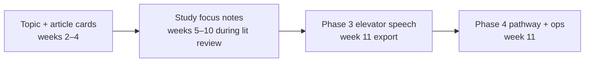

# Design: Capstone Study Plan (PSYC 4223)

**Date:** 2026-09-15 (rev. 4)  
**Scope:** Fall 2026 PSYC 4223 Research Methods — Methods Market `/class/research-methods` plus Canvas course **2406**  
**Worksheets in scope:** Article Review and Problem Statement, Phase 3 Worksheet (elevator speech), Phase 4 Worksheet (Operationalization Exploration)

## Problem

Canvas holds three high-stakes capstone worksheets (200 + 100 + 200 pts). Methods Market today offers Assignment Help tips and chapter links only. Students fill static Word/PDF templates without:

- a structured place to capture article notes and source evaluation,
- continuity from article review through literature review into Phase 3 and Phase 4,
- quick links to chapters and Canvas resources while they work.

Phase 3 thinking (topic, gap, research direction) already happens during **Part 1** while students write the literature review. The Phase 3 Canvas worksheet is being **replaced with an elevator speech** — a short distillation of the lit review and gap, not a new IV/DV/hypothesis worksheet. Methods Market leads with this schema; Canvas assignment **44903** may still show legacy gap→RQ text until the instructor updates it.

Phase 4 **instructions live on Canvas assignment 44935** (fetched via Playwright). Wiki pages `/pages/phase-3-worksheet` and `/pages/phase-4-worksheet` are empty shells.

The platform already has Concept Review, the sampling mini-lab, `CANVAS_METHOD_PATHS`, path tabs, and the Data Analysis Helper — but nothing connects them to the student's own study notes.

## Goals

1. **Capstone Study Plan** — one persisted notebook with sections that match the semester arc.
2. **Guide, don't decide** — checklists and resource links; no auto-grading of thinking, no path recommendations, no generated prose.
3. **Export for Canvas** — copy/paste text matching worksheet sections; PDFs still attach in Canvas.
4. **Canvas template sync** — Playwright scrape keeps Phase 4 (and article-review PDF) field labels current. Phase 3 elevator speech is MM-authored until Canvas assignment text is updated.

## Non-goals

- Grading in Methods Market or LTI submission to Canvas.
- Storing article PDFs in Methods Market.
- AI summarization or rewriting student text.
- Path fit scoring, hypothesis linters, or alignment auto-flags.
- Group/shared projects (v1 is per-user draft).
- BKT updates from worksheet fields.
- Statistics class — Research Methods only.

## Pedagogy (locked)

| OK | Not OK |
|----|--------|
| Checklists that ask students to **look and decide** (peer-reviewed? Method section?) | Pass/fail gates or "this source fails" |
| Links to Ch. 2, library, Canvas checklist, path guides | Recommended path, fit scores, scaffolded problem statements |
| Factual progress ("4 of 8 article cards started") | "You need more design diversity" |
| Read-only reminders of their own earlier fields | Auto-synthesis from cards into gap text |

**Critical thinking stays with the student.** MM holds the template, points to resources, and exports their words.

## Approach (locked)

One **`capstone_projects`** record per student. Three Canvas-aligned sections plus a **Study focus** area used during lit review weeks (weeks 5–10) that feeds Phase 3 export at week 11.



---

## 1. Student experience

### 1.1 Entry points

| Entry | Route |
|-------|-------|
| Class nav | `/class/research-methods/study-plan` |
| Assignment Help CTA | `/class/research-methods/study-plan/:sectionId` |
| `sectionId` values | `article-review`, `study-focus`, `phase-3`, `phase-4` |

### 1.2 Study Plan hub

- Project topic (from Phase 1, editable)
- Progress chips: Article Review · Study focus · Phase 3 · Phase 4
- Links to each section
- No alignment dashboard or auto-flags

Unsigned users: localStorage draft; sign-in to persist.

### 1.3 Sections

#### A. Article Review (`article-review`)

**Due:** 2026-09-11 · 200 pts · **8 article slots** on Canvas template (complete at least **6**; instructor may expect more)

**Canonical schema:** `src/data/capstoneArticleReviewWorksheet.js` (from Canvas `article_review` PDF).

**Header**

| Field | Canvas label |
|-------|----------------|
| `studentName` | Name |
| `proposedProjectTitle` | Proposed title for your project |

**Per article (×8)** — every field required except optional comments; complete sentences, no in-template citations (reference box covers it):

| Field id | Canvas prompt (abbrev.) |
|----------|-------------------------|
| `apaReference` | Complete reference (APA) |
| `researcherWhatQuestion` | Researchers’ “what” question (their RQ and focus) |
| `researcherWhyQuestion` | Researchers’ “why” question (gap / reason for study) |
| `participantsSummary` | Subjects/participants, demographics, sampling, N |
| `methodologyOverview` | Measures, instruments, design overview |
| `resultsSummary` | Results / discussion / conclusion |
| `strengths` | Strengths of the research and design |
| `weaknesses` | Weaknesses of the research and design |
| `connectionToProposal` | How this article helps your proposal / background |
| `otherComments` | Optional notes |

Each field shows a **resource link** (Ch. 2, 4, 5, 7, or 11) — MM does not score or rewrite answers.

**Source self-check** (MM-only, per card — not on Canvas template):

- Found in library database → Ch. 2
- Scholarly peer-reviewed journal → Ch. 2
- Original empirical study (Method + Results) → Ch. 2
- PDF saved; APA reference ready → Ch. 11

**Problem Statement** (end of Article Review assignment — after all article cards):

| Field | Component |
|-------|-----------|
| `whatWeKnow` | What the readings showed |
| `whatWeDontKnow` | The gap |
| `whatWeWantToKnow` | How your research might fill it |
| `problemStatementDraft` | Combined problem statement (student writes; example structure shown as help text only) |

**Research Question(s) and Hypothesis(es)** (same assignment, last page of worksheet):

| Field | Notes |
|-------|-------|
| `researchQuestions` | Early draft; refine during lit review weeks |
| `hypotheses` | Early draft; refine when path is chosen in Phase 4 |

**Coverage (factual only):** “N of 8 articles with required fields started.”

**Export:** Full worksheet order — header, Article 1…8 blocks, Problem Statement, RQ/Hypothesis — for paste into Canvas/Word.

#### B. Study focus (`study-focus`)

**Used:** weeks 5–10 while drafting literature review (not a Canvas submission).

Optional working notes so students do not re-enter at week 11:

| Field | Purpose |
|-------|---------|
| `workingGap` | Draft gap as lit review evolves |
| `workingResearchQuestion` | Optional; refined in prose elsewhere |
| `litReviewThemes` | Bullet notes on what the field agrees on |
| `sourcesToCite` | Reminder list (not duplicate of article cards) |

Assignment Help CTAs on `rm-lit-review-draft-1` and `rm-lit-review-final` link here.

Links: Ch. 2 (gaps, synthesis), Ch. 11 (APA), Canvas Literature Review Checklist.

#### C. Phase 3 — Elevator speech (`phase-3`)

**Due:** 2026-10-30 · 100 pts · submit with Phase 4  
**Canonical schema:** `src/data/capstonePhase3Worksheet.js` (MM-authored; replaces legacy Canvas gap→RQ worksheet)

**Purpose:** A short spoken summary (~60–90 seconds) of **what the literature shows** and **what gap the student's study will address**. This is the distillation of the completed lit review, not a new research-design worksheet.

| Field id | Prompt (guidance only) |
|----------|--------------------------|
| `whatWeKnow` | In 2–4 sentences: what does prior research agree on about your topic? |
| `theGap` | In 1–3 sentences: what is still unknown, untested, or contested? |
| `myStudyPitch` | In 1–3 sentences: how will **your** proposed study address that gap? |
| `elevatorSpeech` | Combined script (~150–250 words) for read-aloud; student composes |

**Sidebar (read-only reminders):** `problemStatement` from article review, `studyFocus.workingGap` — copy/refine, not start blank.

**Resource links:** Ch. 2 (synthesis, gaps), Ch. 11 (clear prose). Lit Review Final Assignment Help.

**Word-count hint only** (not enforced as pass/fail): "Aim for ~150–250 words total; practice reading aloud in about 60–90 seconds."

**Export:** formatted block for Canvas Phase 3 worksheet (section headings: What we know / The gap / My study / Full elevator speech).

**Explicitly out of scope for Phase 3:** IV/DV tables, hypotheses, feasibility checklists, methodology path choice (those belong in Phase 4).

#### D. Phase 4 — Operationalization exploration (`phase-4`)

**Due:** 2026-10-30 · 200 pts · unlocks method-path guides  
**Canvas source:** assignment **44935** (`scripts/canvas-rm-assignment-instructions.json`)  
**Canonical schema:** `src/data/capstonePhase4Worksheet.js`  
**Supplementary wiki:** `/pages/helpful-table` (IV/DV logic table); path guide pages for Path 1–4

**Part A — Context recap**

| Field id | Notes |
|----------|-------|
| `broadTopicArea` | e.g., Social Media, Sleep, Parenting |
| `proposedResearchQuestion` | prefill from `studyFocus.workingResearchQuestion` |

**Part B — Conceptual definitions** (from lit review; student fills in Phase 4)

| Field id | Notes |
|----------|-------|
| `ivConceptual` | Define based on lit review |
| `dvConceptual` | Define based on lit review |

**Part C — Four pathways** (student explores each; mark `notViable` if path does not fit)

| Pathway | Canvas label | MM `canvasMethodPathId` | Fields |
|---------|--------------|-------------------------|--------|
| Survey | Pathway 1 (Self-Report / Survey) | `path-1-survey` | `validatedScales` |
| Experimental | Pathway 2: Performance / Experimental Task | `path-3-experimental` | `taskDescription`, `comparisonGroup` |
| Observation | Pathway 3: Observation / Naturalistic Recording | `path-2-qualitative` | `whatToObserve`, `observationDuration` |
| Archival | Pathway 4: Archival | `path-4-archival` | `existingDataset` |

Each pathway links to its Canvas path guide page + chapter (`METHOD_PATHS_LIST`).

**Part D — Comparative analysis table**

Rows: feasibility, access, measurement quality, ethics/IRB, optional notes × four pathway columns. MM shows Helpful Table link; student fills cells — no scoring.

**Part E — Final decision**

`chosenPathwayId` — one pathway. Unlocks embedded `DataAnalysisHelper` with matching `methodPathId` (reuse existing component).

**Export:** Parts A–E in Canvas field order.

---

## 2. Data model

### 2.1 `capstone_projects`

```json
{
  "topic": "",
  "searchTerms": [],
  "articleReview": {
    "studentName": "",
    "proposedProjectTitle": "",
    "articleCards": [ /* 8 slots, ArticleCard */ ],
    "problemStatement": {
      "whatWeKnow": "",
      "whatWeDontKnow": "",
      "whatWeWantToKnow": "",
      "problemStatementDraft": ""
    },
    "researchQuestions": "",
    "hypotheses": ""
  },
  "studyFocus": {
    "workingGap": "",
    "workingResearchQuestion": "",
    "litReviewThemes": "",
    "sourcesToCite": ""
  },
  "phase3": {
    "whatWeKnow": "",
    "theGap": "",
    "myStudyPitch": "",
    "elevatorSpeech": ""
  },
  "phase4": {
    "broadTopicArea": "",
    "proposedResearchQuestion": "",
    "ivConceptual": "",
    "dvConceptual": "",
    "pathwayResponses": {},
    "comparisonTable": {},
    "chosenPathwayId": ""
  }
}
```

Autosave: debounced PATCH. User-scoped.

### 2.2 Schema source

| File | Source |
|------|--------|
| `capstoneArticleReviewWorksheet.js` | Canvas PDF template |
| `capstonePhase3Worksheet.js` | MM-authored elevator speech (replaces legacy Canvas 44903) |
| `capstonePhase4Worksheet.js` | Canvas assignment 44935 (Playwright) |
| `capstoneWorksheetSchemas.js` | Study focus + `emptyCapstoneProject()` aggregator |
| `scripts/fetch-canvas-rm-assignment-instructions.mjs` | Drift check for Phase 4 assignment text |

---

## 3. Validation library (minimal)

`src/lib/capstoneValidation.js`:

- `buildExportText(sectionId, project)` — format for Canvas paste (headings from schema `exportLabel`s)
- `countArticleCards(project)` — factual
- `elevatorSpeechWordCount(text)` — display hint only (from `capstonePhase3Worksheet.js`)

No `lintHypothesisLanguage`, no `checkPhase34Alignment`, no `checkOriginalResearchGate` pass/fail.

---

## 4. UI architecture

```
src/views/StudyPlanHub.vue
src/views/StudyPlanSection.vue
src/components/study-plan/
  ArticleCardEditor.vue
  SourceChecklist.vue
  StudyFocusNotes.vue
  ElevatorSpeechForm.vue
  Phase4PathwayExplorer.vue
  Phase4ComparisonTable.vue
  StudyPlanExportPanel.vue
src/composables/useCapstoneProject.js
```

Reuse `DataAnalysisHelper` embedded in Phase 4 when path chosen. Reuse `METHOD_PATHS_LIST` for pathway columns — do not build a separate path explorer.

---

## 5. Phased delivery (Fall 2026)

| Phase | Ship by | Deliverable |
|-------|---------|-------------|
| P0 | Aug 31 | API + hub + schemas |
| P1 | Sep 4 | Article Review + source checklists + export |
| P1.5 | Sep 14 | Study focus + lit review Assignment Help links |
| P2 | Oct 19 | Phase 4 pathway + ops |
| P2-light | Oct 26 | Phase 3 elevator speech + export |

---

## 6. Canvas content sources

| Worksheet | Canvas location | Playwright script |
|-----------|-----------------|-------------------|
| Article Review | Assignment 44898 + PDF template | PDF archive + assignment scrape |
| Phase 3 | MM elevator speech schema (Canvas 44903 pending instructor update) | — |
| Phase 4 | Assignment **44935** description | `fetch-canvas-rm-assignment-instructions.mjs` |
| Helpful Table | Wiki `/pages/helpful-table` | `fetch-canvas-rm-worksheets-playwright.mjs` |
| Path guides | Wiki `path-1` … `path-4` pages | same |

Wiki pages `/pages/phase-3-worksheet` and `/pages/phase-4-worksheet` are **empty** — do not scrape them for field labels.

---

## 7. Success criteria

1. Student completes article cards, study focus notes, elevator speech, and Phase 4 in one Study Plan; exports each section for Canvas.
2. Phase 3 export is a readable elevator speech, not a methods table.
3. Phase 4 field labels match Canvas assignment 44935 (Playwright-verified).
4. Source checklists link to Ch. 2 and library; MM never labels a source invalid.
5. Phase 4 reuses existing path tabs and Data Analysis Helper.
