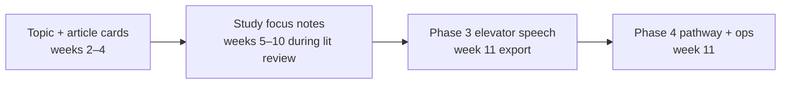

# Design: Capstone Study Plan (PSYC 4223)

**Date:** 2026-09-15 (rev. 2)  
**Scope:** Fall 2026 PSYC 4223 Research Methods — Methods Market `/class/research-methods` plus Canvas course **2406**  
**Worksheets in scope:** Article Review and Problem Statement, Phase 3 Worksheet (elevator speech), Phase 4 Worksheet (Operationalization Exploration)

## Problem

Canvas holds three high-stakes capstone worksheets (200 + 100 + 200 pts). Methods Market today offers Assignment Help tips and chapter links only. Students fill static Word/PDF templates without:

- a structured place to capture article notes and source evaluation,
- continuity from article review through literature review into Phase 3 and Phase 4,
- quick links to chapters and Canvas resources while they work.

Phase 3 thinking (topic, gap, research direction) already happens during **Part 1** while students write the literature review. The Phase 3 Canvas worksheet should **not** duplicate IV/DV/hypothesis work; it should capture an **elevator speech** summarizing the lit review and gap.

The platform already has Concept Review, the sampling mini-lab, `CANVAS_METHOD_PATHS`, path tabs, and the Data Analysis Helper — but nothing connects them to the student's own study notes.

## Goals

1. **Capstone Study Plan** — one persisted notebook with sections that match the semester arc.
2. **Guide, don't decide** — checklists and resource links; no auto-grading of thinking, no path recommendations, no generated prose.
3. **Export for Canvas** — copy/paste text matching worksheet sections; PDFs still attach in Canvas.
4. **Canvas template sync** — Playwright scrape of Canvas 2406 keeps field labels current.

## Non-goals

- Grading in Methods Market or LTI submission to Canvas.
- Storing article PDFs in Methods Market.
- AI summarization or rewriting student text.
- Path fit scoring, hypothesis linters, or alignment auto-flags.
- Group/shared projects (v1 is per-user draft).
- BKT updates from worksheet fields.
- Statistics class — Research Methods only.

## Pedagogy (locked)

| OK | Not OK |
|----|--------|
| Checklists that ask students to **look and decide** (peer-reviewed? Method section?) | Pass/fail gates or "this source fails" |
| Links to Ch. 2, library, Canvas checklist, path guides | Recommended path, fit scores, scaffolded problem statements |
| Factual progress ("4 of 8 article cards started") | "You need more design diversity" |
| Read-only reminders of their own earlier fields | Auto-synthesis from cards into gap text |

**Critical thinking stays with the student.** MM holds the template, points to resources, and exports their words.

## Approach (locked)

One **`capstone_projects`** record per student. Three Canvas-aligned sections plus a **Study focus** area used during lit review weeks (weeks 5–10) that feeds Phase 3 export at week 11.



---

## 1. Student experience

### 1.1 Entry points

| Entry | Route |
|-------|-------|
| Class nav | `/class/research-methods/study-plan` |
| Assignment Help CTA | `/class/research-methods/study-plan/:sectionId` |
| `sectionId` values | `article-review`, `study-focus`, `phase-3`, `phase-4` |

### 1.2 Study Plan hub

- Project topic (from Phase 1, editable)
- Progress chips: Article Review · Study focus · Phase 3 · Phase 4
- Links to each section
- No alignment dashboard or auto-flags

Unsigned users: localStorage draft; sign-in to persist.

### 1.3 Sections

#### A. Article Review (`article-review`)

**Due:** 2026-09-11 · 200 pts · 6–8 original-research articles

**Per-article card:**

| Field | Notes |
|-------|-------|
| `apaReference` | Student enters; optional DOI for their own lookup |
| `participants` | N, population, recruitment |
| `designType` | enum + link to relevant chapter (Ch. 5/6/7) |
| `measures` | Instruments/scales |
| `keyFindings` | Their summary |
| `relevanceNote` | How it relates to their topic |
| `sourceChecklist` | Self-check boxes (see below) |

**Source evaluation checklist** (per card — student attests, MM does not judge):

- □ Found through library database (PsycINFO, etc.) → link Ch. 2 + library help
- □ Appears in a scholarly journal → what to look for (volume, issue, peer review)
- □ Has Method and Results with original data → not a review/meta chapter
- □ PDF saved; APA reference ready → Ch. 11

**Problem statement** — single text field + prompt ("What problem does your reading point toward?") + link Ch. 2. No auto-fill from cards.

**Coverage (factual only):** card count, design labels used.

**Export:** annotated bibliography block + problem statement.

#### B. Study focus (`study-focus`)

**Used:** weeks 5–10 while drafting literature review (not a Canvas submission).

Optional working notes so students do not re-enter at week 11:

| Field | Purpose |
|-------|---------|
| `workingGap` | Draft gap as lit review evolves |
| `workingResearchQuestion` | Optional; refined in prose elsewhere |
| `litReviewThemes` | Bullet notes on what the field agrees on |
| `sourcesToCite` | Reminder list (not duplicate of article cards) |

Assignment Help CTAs on `rm-lit-review-draft-1` and `rm-lit-review-final` link here.

Links: Ch. 2 (gaps, synthesis), Ch. 11 (APA), Canvas Literature Review Checklist.

#### C. Phase 3 — Elevator speech (`phase-3`)

**Due:** 2026-10-30 · 100 pts · submit with Phase 4

**Purpose:** A short spoken summary (~60–90 seconds) of **what the literature shows** and **what gap the student's study will address**. This is the distillation of the completed lit review, not a new research-design worksheet.

| Field | Prompt (guidance only) |
|-------|------------------------|
| `whatWeKnow` | In 2–4 sentences: what does prior research agree on about your topic? |
| `theGap` | In 1–3 sentences: what is still unknown, untested, or contested? |
| `myStudyPitch` | In 1–3 sentences: how will **your** proposed study address that gap? |
| `elevatorSpeech` | Combined script (~150–250 words) for read-aloud; student composes |

**Sidebar (read-only reminders):** `problemStatement` from article review, `workingGap` from study focus — so they can copy/refine, not start blank.

**Resource links:** Ch. 2 (synthesis, gaps), Ch. 11 (clear prose). Lit Review Final Assignment Help.

**Word-count hint only** (not enforced as pass/fail): "Aim for ~150–250 words total; practice reading aloud in about 60–90 seconds."

**Export:** formatted block for Canvas Phase 3 worksheet (section headings match Canvas scrape).

**Explicitly out of scope for Phase 3:** IV/DV tables, hypotheses, feasibility checklists, methodology path choice (those belong in Phase 4 or the methods section).

#### D. Phase 4 — Pathway & operationalization (`phase-4`)

**Due:** 2026-10-30 · 200 pts · unlocks method-path guides

Unchanged role: **new design work** at week 11.

**Pathway table** — for each `path-1-survey` … `path-4-archival` (from `CANVAS_METHOD_PATHS`):

| Column | Notes |
|--------|-------|
| `couldUseThisPath` | yes / no / unsure — student decides |
| `researchQuestionFit` | How their question would look on this path |
| `ivDvOrConstructs` | Variables or constructs for this path |
| `samplingOrAssignment` | |
| `measurementPlan` | |
| `feasibilityNote` | |

Each column header links to existing path guide + chapter (`METHOD_PATHS_LIST`, Assignment Help Path 1–4).

**Chosen path:** `chosenPathId` — unlocks embedded `DataAnalysisHelper` with `methodPathId` (reuse existing component).

**Operationalization table** (Helpful Table) — per construct:

`constructName`, `operationalDefinition`, `scaleOrInstrument`, `measurementLevel`, `reliabilityEvidence`, `validityThreats`, `validityMitigation`

Seed construct name rows from `myStudyPitch` / study focus **as empty placeholders only** (student fills definitions).

**Export:** pathway table + operationalization for chosen path.

---

## 2. Data model

### 2.1 `capstone_projects`

```json
{
  "topic": "",
  "searchTerms": [],
  "articleCards": [],
  "problemStatement": "",
  "studyFocus": {
    "workingGap": "",
    "workingResearchQuestion": "",
    "litReviewThemes": "",
    "sourcesToCite": ""
  },
  "phase3": {
    "whatWeKnow": "",
    "theGap": "",
    "myStudyPitch": "",
    "elevatorSpeech": ""
  },
  "phase4": {
    "pathwayRows": {},
    "chosenPathId": "",
    "operationalizations": []
  }
}
```

Autosave: debounced PATCH. User-scoped.

### 2.2 Schema source

`src/data/capstoneWorksheetSchemas.js` + Playwright scrape → `scripts/canvas-rm-worksheet-fields.json`

---

## 3. Validation library (minimal)

`src/lib/capstoneValidation.js`:

- `buildExportText(sectionId, project)` — format for Canvas paste
- `countArticleCards(project)` — factual
- `elevatorSpeechWordCount(text)` — display hint only

No `lintHypothesisLanguage`, no `checkPhase34Alignment`, no `checkOriginalResearchGate` pass/fail.

---

## 4. UI architecture

```
src/views/StudyPlanHub.vue
src/views/StudyPlanSection.vue
src/components/study-plan/
  ArticleCardEditor.vue
  SourceChecklist.vue
  StudyFocusNotes.vue
  ElevatorSpeechForm.vue
  PathwayTable.vue
  OperationalizationTable.vue
  StudyPlanExportPanel.vue
src/composables/useCapstoneProject.js
```

Reuse `DataAnalysisHelper` embedded in Phase 4 when path chosen. Reuse `METHOD_PATHS_LIST` for pathway columns — do not build a separate path explorer.

---

## 5. Phased delivery (Fall 2026)

| Phase | Ship by | Deliverable |
|-------|---------|-------------|
| P0 | Aug 31 | API + hub + schemas |
| P1 | Sep 4 | Article Review + source checklists + export |
| P1.5 | Sep 14 | Study focus + lit review Assignment Help links |
| P2 | Oct 19 | Phase 4 pathway + ops |
| P2-light | Oct 26 | Phase 3 elevator speech + export |

---

## 6. Assignment Help copy (Phase 3)

Phase 3 tips should describe elevator speech, not IV/DV/hypothesis. See `assignmentHelpResearchMethods.js`.

---

## 7. Success criteria

1. Student completes article cards, study focus notes, elevator speech, and Phase 4 in one Study Plan; exports each section for Canvas.
2. Phase 3 export is a readable elevator speech, not a methods table.
3. Source checklists link to Ch. 2 and library; MM never labels a source invalid.
4. Phase 4 reuses existing path tabs and Data Analysis Helper.
5. Playwright scrape documents Canvas Phase 3 field headings (updated for elevator speech if Canvas assignment text changes).
