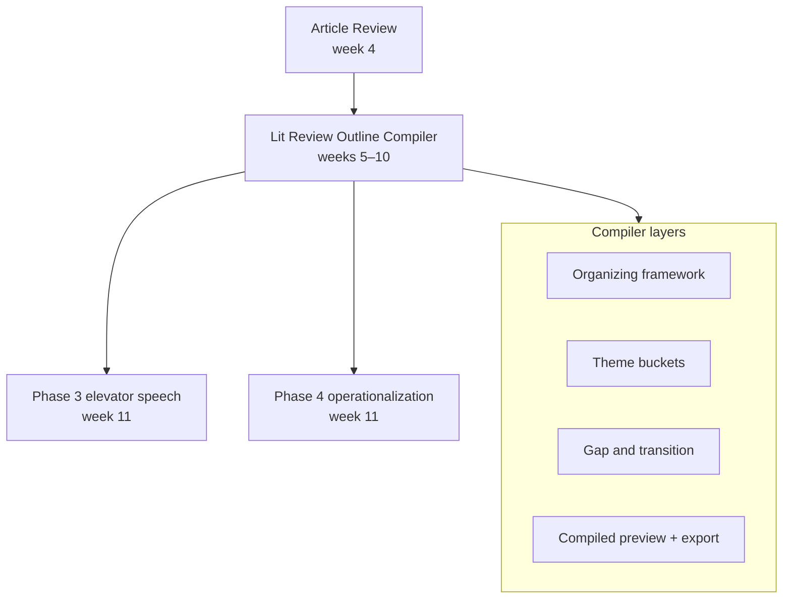

# Design: Lit Review Outline Compiler (replaces Study Focus)

**Date:** 2026-09-15  
**Scope:** PSYC 4223 Research Methods — Study Plan section `study-focus` (display title: **Lit Review Outline**)  
**Replaces:** Study Focus freeform note fields (`workingGap`, `litReviewThemes`, etc.)

## Problem

Study Focus was four disconnected text areas. Students drafting the literature review (weeks 5–10) need:

1. An **organizing framework or theory** that routes the review (not a list of article summaries).
2. **Theme buckets** for synthesis across studies.
3. A **compiled outline** they can export for Lit Review Draft 1 (outline + partial draft).

Canvas Draft 1 requires clear section headings and thematic synthesis — not one paragraph per article. Methods Market should scaffold that structure without writing prose for the student.

## Goals

1. **Framework-first outline** — theory/model name + student-written mechanism prompts before theme work.
2. **Theme buckets** — template-seeded, editable, with manual article # links.
3. **Live compiled preview** — read-only assembly of the student's own text in outline order.
4. **Export** — copy + PDF of compiled outline for Word/Canvas.
5. **Continuity** — reminders from Article Review; gap/RQ feed Phase 3 and Phase 4.

## Non-goals

- MM recommending or scoring a framework for the student's topic.
- Auto-synthesizing theme text from article cards.
- AI-generated outline prose.
- Grading or pass/fail on framework fit.
- Storing lit review full draft in MM (outline compiler only).

## Pedagogy (locked)

| OK | Not OK |
|----|--------|
| Prompted worksheet fields | MM picks the "right" theory |
| Browse-only framework reference by construct area | "Use Social Learning Theory for your topic" |
| Manual article # links with read-only card peek | Auto-fill buckets from card summaries |
| Factual progress ("framework named · 2/3 themes started") | "Your themes don't match your framework" |
| Read-only reminders from Article Review | Auto-synthesis from cards into gap text |

**Critical thinking stays with the student.** MM holds structure, prompts, references, and export.

## Approach (locked)

**In-place replace** Study Focus on route `study-focus`. Display title **Lit Review Outline** (subtitle: *Literature review outline compiler*). Keep route slug for existing Assignment Help links.



---

## 1. Student experience

### 1.1 Section entry

| Entry | Route |
|-------|-------|
| Study Plan hub | `/class/research-methods/study-plan/study-focus` |
| Assignment Help (Draft 1, Final) | `studyPlanSection: 'study-focus'` (unchanged slug) |

**Hub card title:** Lit Review Outline  
**Hub card description:** Framework, theme buckets, and compiled outline for your lit review.

### 1.2 Page layout (top → bottom)

1. **Guided tour** — framework → reference panel → theme buckets → gap → compiled preview → export.
2. **Arc banner** — Article Review (week 4) → Lit Review Outline (weeks 5–10) → Phase 3 & 4 (week 11). Not a Canvas submission.
3. **From Article Review** (read-only reminders) — problem statement draft, early RQ, article card progress. Link to Article Review.
4. **Organizing framework** (fixed first block).
5. **Framework ideas** (collapsible reference panel).
6. **Theme buckets** (template-seeded, editable).
7. **Gap & transition** (fixed final block).
8. **Compiled outline preview** (live, read-only).
9. **Resource links** — Ch. 2, Ch. 11, Canvas Literature Review Checklist.
10. **Export panel** — copy text + download PDF.

### 1.3 Organizing framework block

Always shown first. Student writes all content.

| Field id | Label | Prompt |
|----------|-------|--------|
| `theoryName` | Theory or model name | e.g., Social Learning Theory, Self-Determination Theory |
| `mechanismExplanation` | Mechanism | How does this framework connect your IV and DV? |
| `whyThisFramework` | Why this framework? | Why organize the review this way instead of a purely descriptive summary? |
| `alternativeConsidered` | Alternative considered (optional) | What other framework did you consider and set aside? |

Tour step includes narrow/widen tips (e.g., narrow: multiple theories named — pick one primary lens; widen: mechanism too vague — name the pathway).

### 1.4 Framework ideas reference panel

Collapsible **"Framework ideas (browse only)"** — MM does not filter by student topic.

**Structure:** Grouped by construct area (static curated list in `capstoneLitReviewFrameworkReference.js`):

- Social / interpersonal  
- Motivation / self-regulation  
- Stress / coping / health  
- Cognitive / information processing  
- Developmental  

Each entry:

| Property | Example |
|----------|---------|
| `name` | Social Learning Theory |
| `summary` | One-line description |
| `helpTopicId` | `rm-chapter-2` (or other Pressbooks topic) |

No "recommended for you." Student may copy a name into `theoryName` manually.

### 1.5 Theme buckets

**Template-seeded on first load** (editable titles, deletable except minimum one theme):

| Default title | `templateId` |
|---------------|--------------|
| Background / context | `background` |
| Theme 1 | `theme-1` |
| Theme 2 | `theme-2` |

**Per bucket fields:**

| Field id | Label |
|----------|-------|
| `title` | Section heading (editable) |
| `synthesisNotes` | Synthesis bullets (multiline) |
| `connectionToFramework` | How does this theme support your organizing framework? |
| `linkedArticleNumbers` | Article card numbers (comma-separated, e.g. `1, 3, 5`) |

**Actions:** `+ Add theme`, delete bucket (confirm if has content), reorder via up/down buttons (v1 — no drag-drop required).

**Article link behavior:**

- Parse `linkedArticleNumbers` as integers matching 1-based article card index.
- Show read-only peek: "Article 3: [first line of APA ref]" when linked and card exists.
- Invalid numbers show neutral hint: "No card for Article N yet."
- Never copy card field text into `synthesisNotes`.

### 1.6 Gap & transition block

| Field id | Label | Notes |
|----------|-------|-------|
| `gapStatement` | Working gap | What is still unknown or contested? |
| `transitionToStudy` | Transition to your study | Bridge from gap to your proposed project |
| `workingResearchQuestion` | Working research question | Prefills Phase 4 Part A proposed RQ |

Feeds Phase 3 `theGap` reminder and Phase 4 copy button.

### 1.7 Compiled outline preview

Read-only panel updates on debounced input (~400ms). Assembles student text only:

```
ORGANIZING FRAMEWORK
Theory: [theoryName]
Mechanism: [mechanismExplanation]
...

I. [Background / context title]
   [synthesisNotes]
   Framework link: [connectionToFramework]
   Sources: Articles [linkedArticleNumbers]

II. [Theme 1 title]
   ...

GAP AND TRANSITION
Gap: [gapStatement]
Transition: [transitionToStudy]
Working RQ: [workingResearchQuestion]
```

No prose generation. Empty sections omitted or shown as "(not filled in)" in export only; preview may show section headers with placeholder hints.

### 1.8 Progress (factual)

Hub and section chip examples:

- `Framework not started` — no `theoryName`
- `Framework named · 1/3 themes started` — at least one bucket with synthesis content
- `Outline ready to export` — framework named + at least 2 buckets with content + gap started (display hint only, not pass/fail)

### 1.9 Export

`buildExportText('study-focus', project)` returns compiled outline text (same as preview, formatted for paste).

PDF export via existing `capstoneExportPdf.js` pattern.

Export filename: `lit-review-outline-draft-YYYY-MM-DD.pdf`

---

## 2. Data model

### 2.1 Project shape

Replace `project.studyFocus` object with `project.litReviewOutline`:

```javascript
litReviewOutline: {
  organizingFramework: {
    theoryName: '',
    mechanismExplanation: '',
    whyThisFramework: '',
    alternativeConsidered: ''
  },
  themeBuckets: [
    {
      id: 'uuid-or-stable-id',
      templateId: 'background', // null if user-added
      title: 'Background / context',
      synthesisNotes: '',
      connectionToFramework: '',
      linkedArticleNumbers: '' // stored as string "1, 3, 5" for simplicity
    }
  ],
  gapAndTransition: {
    gapStatement: '',
    transitionToStudy: '',
    workingResearchQuestion: ''
  }
}
```

Persist in `useCapstoneProject` localStorage key (same project blob; migration on load).

### 2.2 Migration from `studyFocus`

On project load, if `studyFocus` exists and `litReviewOutline` does not:

| Old field | New location |
|-----------|--------------|
| `workingGap` | `gapAndTransition.gapStatement` |
| `workingResearchQuestion` | `gapAndTransition.workingResearchQuestion` |
| `litReviewThemes` | First theme bucket `synthesisNotes` (prefer `theme-1`, else first bucket) |
| `sourcesToCite` | Append to last theme bucket notes as line `Sources to cite: …` or drop if empty |

Delete `studyFocus` after migration. One-time, idempotent.

### 2.3 Schema files

| File | Role |
|------|------|
| `capstoneLitReviewOutlineWorksheet.js` | Field defs, default buckets, `emptyLitReviewOutline()`, compile helpers |
| `capstoneLitReviewFrameworkReference.js` | Static framework browse list |
| `capstoneLitReviewOutlineWalkthrough.js` | Tour steps (replaces `capstoneStudyFocusWalkthrough.js`) |
| `capstoneWorksheetSchemas.js` | Update section metadata; remove `STUDY_FOCUS_FIELDS` |

---

## 3. Components (Vue)

| Component | Role |
|-----------|------|
| `LitReviewOutlineSection.vue` | Replaces `StudyFocusSection.vue` |
| `OrganizingFrameworkBlock.vue` | Framework prompts |
| `FrameworkReferencePanel.vue` | Collapsible browse list |
| `ThemeBucketEditor.vue` | Single bucket card |
| `ThemeBucketList.vue` | List + add/reorder |
| `CompiledOutlinePreview.vue` | Live read-only preview |
| `LitReviewOutlineWalkthrough.vue` | Replaces `StudyFocusWalkthrough.vue` |

`StudyPlanSection.vue`: import `LitReviewOutlineSection` for `study-focus` case.

Phase 3 / Phase 4 reminders: read `litReviewOutline.gapAndTransition` instead of `studyFocus`.

---

## 4. Static preview (`public/study-plan-drafts.html`)

Sync tab label **Lit Review Outline** with same structure:

- Framework block + reference panel (static HTML list)
- Three seeded theme buckets + add theme
- Gap block
- Compiled preview + localStorage autosave
- Tour (updated steps)
- Hub progress chip

Storage key: `study-plan-drafts-lit-review-outline-v1` (migrate from `study-plan-drafts-study-focus-v1` if present).

---

## 5. Validation / export library

`capstoneValidation.js` changes:

- Replace `countStudyFocusFields` → `countLitReviewOutlineProgress(project)`
- Replace `buildStudyFocusExport` → `compileLitReviewOutline(project)` (shared with preview component)
- `buildExportText('study-focus', …)` uses compiler output

---

## 6. Assignment Help updates

`assignmentHelpResearchMethods.js`:

- Tips mention framework + theme buckets + compiled outline (not "study focus notes").
- `studyPlanSection: 'study-focus'` unchanged.

Phase 3 tip: "Use your Lit Review Outline, article reviews, and Lit Review Final…"

---

## 7. Acceptance criteria

1. Student can name an organizing framework, fill mechanism prompts, and add/edit theme buckets with manual article links.
2. Compiled preview updates from student input without auto-pulling card text.
3. Export produces hierarchical outline suitable for Lit Review Draft 1 paste.
4. Framework reference panel is browse-only; no topic-based recommendations.
5. Existing `studyFocus` localStorage data migrates without data loss for gap/RQ/themes.
6. Phase 3 and Phase 4 read gap/RQ from `litReviewOutline.gapAndTransition`.
7. Static preview parity on `study-plan-drafts.html` Focus tab.

---

## 8. Out of scope (v1)

- Drag-and-drop bucket reorder (up/down buttons sufficient).
- Full-text lit review drafting in MM.
- Search term builder in this section (stays in Article Review).
- Backend `capstone_projects` API (localStorage only until server storage ships).

---

## 9. Implementation order

1. Schema + migration + compile helper  
2. Vue section components + walkthrough  
3. Hub progress + Phase 3/4 reminder wiring  
4. Static HTML preview sync  
5. Remove deprecated Study Focus files (`StudyFocusSection.vue`, `capstoneStudyFocusWalkthrough.js`, etc.)
